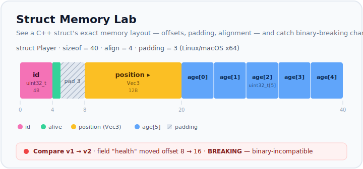

# Struct Memory Lab

[](https://github.com/kaandemirlek/struct-memory-lab/actions/workflows/ci.yml)

<p align="center">
  
</p>

A web tool for safely evolving a C++ struct. Import a struct, **see its exact memory layout** (offsets, padding, alignment, size), edit it, snapshot versions over time, and get clear warnings when a change would break binary compatibility — before it reaches production.

It's designed so that even people who aren't systems experts can understand and review a struct change: the complexity of alignment and padding is shown visually, and an optional AI assistant explains things in plain language.

> The memory layout is computed by a deterministic engine with selectable platform/ABI rules (x86‑64 Linux/macOS, Windows x64, 32-bit x86). The AI assistant only *explains* that output — it never computes the layout itself.

## Features

- **Import** a C++ struct by pasting a header (`.h` / `.hpp`).
- **Memory layout visualizer** — proportional, color-coded byte map with offsets and padding that auto-scales to fit.
- **Platform / ABI presets** — switch between x86‑64 Linux/macOS (LP64), Windows x64 (LLP64), and 32-bit x86 (ILP32); the layout updates live (`long`, `size_t`, and 8-byte alignment differ by target).
- **Field editor** — rename fields, change types (including nested structs and `#pragma pack`), and drag to reorder, with the layout updating live.
- **Undo / redo** for every edit.
- **Versioning** — save, restore, rename, and delete snapshots. Preview an old snapshot read-only without disturbing your working copy.
- **Compare** any two versions (or your live edits): a color-coded diff plus a **binary-compatibility report** (offset shifts, truncation, size/alignment changes, with a breaking / risky / compatible verdict).
- **Layout optimizer** — suggests a field reordering that reduces padding and shows a visual before/after, one click to apply.
- **AI assistant** — an "Ask AI" chat panel that answers questions about your struct ("why is there padding here?", "what changed in v2?"). Works offline with best-effort answers; optionally uses OpenAI for full conversational help.
- **Shareable links** — copy a permalink that opens the tool at a specific struct/version, handy for code reviews and tickets.
- **Annotations** — leave notes on specific fields or versions (e.g. "don't move this, the serializer depends on the offset").
- **Export** — regenerate a C++ header, export JSON, or download a Markdown diff report.
- **CLI / CI check** — fail a build when a struct change is binary-incompatible.
- Work is **saved automatically** in your browser (localStorage) and survives reloads. Dark mode included.

## Quick start

Requires Node.js 20+.

```bash
npm install       # install dependencies
npm run dev       # start the app at http://localhost:3000
```

Other scripts:

```bash
npm run build     # production build
npm start         # serve the production build
npm test          # run the test suite (Vitest)
npm run lint      # lint
npx tsc --noEmit  # type-check
```

## Using the app

1. **Import or edit** — paste a C++ struct with *Import*, or edit the fields directly on the left. The memory layout updates as you type.
2. **Save versions** — snapshot the struct whenever you reach a meaningful state. Each snapshot is stored with a timestamp and change summary.
3. **Compare** — switch to the *Compare Versions* tab and pick a *From* and *To* (any saved version, or your live edits). You'll see what changed and whether it's binary-compatible.
4. **Optimize** — if reordering fields would save space, an optimizer panel shows the before/after and can apply it.
5. **Share / annotate** — copy a version's permalink for review, and leave notes on fields or versions.
6. **Export** — produce a `.hpp`, JSON, or a Markdown diff report from the *Export* menu.

## AI assistant (optional)

The **Ask AI** panel (bottom-right) is grounded on the deterministic engine's output, so its answers reflect your real layout.

- **Offline by default** — with no configuration it gives best-effort answers about size, padding, alignment, fields, versions, and changes. No API key or network needed.
- **Live mode** — for full conversational answers, copy `.env.example` to `.env.local`, set `AI_MODE=live`, and add an `OPENAI_API_KEY`. If a request fails (e.g. a network/proxy block) it falls back to offline mode automatically. In live mode, each reply shows its token usage and estimated cost.

## CI integration (CLI)

`struct-check` compares a baseline struct against a candidate and exits non-zero when the change is binary-incompatible, so a pipeline can gate merges:

```bash
# accepts .hpp headers or .json struct models
npm run struct-check -- examples/player.v1.json examples/player.v2.json

# options
#   --strict          also fail on non-breaking "risky" warnings
#   --json            emit machine-readable output
#   --platform=<id>   target ABI: linux64 | win64 | x86-32 (default linux64)
```

Exit codes: `0` compatible, `1` incompatible, `2` usage/parse error. See `examples/` for sample inputs.

## Tech stack

Next.js (App Router) · React · TypeScript · Zustand · Tailwind CSS · Vitest. Optional OpenAI for live AI answers.

## Project structure

```
src/
  engine/       Deterministic core: parser, layout, diff, compatibility,
                optimizer, exporter, validation, versioning
  components/   React UI (editor, visualizer, version panel, chat, ...)
  store/        Shared Zustand store (persisted to localStorage)
  lib/ai/       AI assistant layer (grounding, mock, prompt, client)
  cli/          struct-check CI tool
scripts/        CLI runner
examples/       Sample struct models
```
